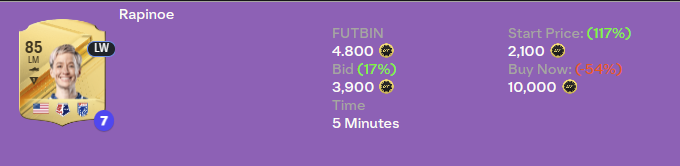

[Back](README.md)

# Bidding

## Massbidding
With the highlight bargains functionality of the [FUT Enhancer](tools.md) extension, it's quite easy to find players that are listed below their market value. You can then bid on them and sell them for a profit. This method is quite time consuming, but it's a good way to make coins without much risk or waiting involved.

It works great when bidding on fodder cards, especially when they're on a low or big SBC's are coming up. That way it's basically risk free.

This method is especially profitable during the night, as competition is lower and you're able to snatch the odd bargain here and there. Another reason to do this during the night is that you the prices of those cards are usually lower than during the day. So you can bid on a lot of cards and sell them during the day for a nice profit.

I aim for a profit of 8%+ per card for 85's but you can go for more or less depending on the card and the market situation. Make sure to include the 5% tax in your calculations. The FUT Enhancer extension has a nice feature that shows you the profit after tax.

When going for fodder, I'm usually going with 85 or 86 rated cards, as there's less competition and the profit margins are better. But feel free to go for higher rated cards if you have the coins to bid on 20-50 of them.

## High end bidding
With this method bid on a couple or just one big card. Most of the time you end up in a bidding war and the price usually goes beyond the market value. But every now and then, you'll be able to get a great steal. This method is not recommended for beginners as it's quite risky and selling the card can take a while, especially on PC.