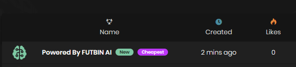
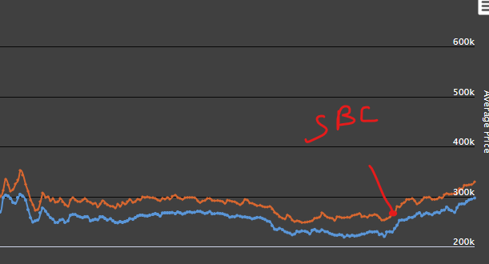

[Back](README.md)

# SBC Investing

There are multiple ways you can use upcoming SBC's for some nice profit.

## FutBin SBC Solutions
When browsing SBC solutions on FutBin, you've probably noticed the squads called "Powered By FUTBIN AI". They are usually the cheapest solutions available and are created by the FutBin AI. It's also featured at the top, has usually the "new" and "cheapest" tags and are therefore the most used solutions at that time.

If you're fast (like a few seconds or minutes after the solution drops), you can get some of those players (especially silvers for low end SBC's) for a really cheap price. Just relist them instantly for the a couple thousands (if there are no cheaper listings), and you'll make a nice profit.

BUT be careful and prepared, that you might not be able to sell them at all, so it's best to get those players for close to their min price to minimize the risk.

Non rare golds and rare bronzes are also a solid option.

This was especially profitable during the first few weeks of the game cycle as everyone was doing the advanced SBC's.

## Create own solutions on FutBin
You can also submit your own solutions on FutBin with players you already had at the club or bought for extremely cheap before submitting the solution. This will net you a decent profit, but you'll need to do that for SBC's that are relatively difficult to solve, so players are less likely to find a solution themselves.

## Buying players for upcoming SBC's
With league SBC's and expensive Marquee Matchups gone for a while now, you won't be really able to invest into players used for those SBC's. But there's still a way to make some profit with upcoming SBC's.

It's a bit reliant on either leaks, predictions or speed. You will need to find players that can be used to link upcoming SBC players.

For example, the Trailblazers Rodrygo SBC just dropped recently and other Real Madrid players at a similar price range went up by a lot because of the links. As there were quite a few reliable leaks for this SBC, you could've invested into those players before the SBC dropped.

Cards like RTTK Modric and TOTW/Gold Bellingham rose quite a lot. The profit got amplified by the fact that those cards also went out of packs at the same time.

